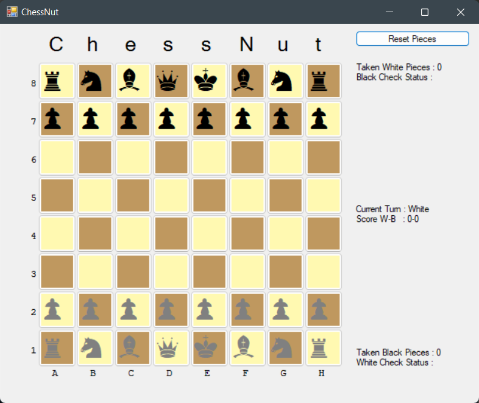

# ChessNut
Chess being written in c#

  

## Features
* [x] 2 Player Turn Based Game
* [x] Click controls to select/move piece
* [x] Show available moves of a selected piece
* [x] Check warning shown when King is under attack
* [x] Basic Game stats for each player (number of game won, number of pieces captured)

#### Special Moves
* [x] En Passant
* [ ] Pawn Promotion (In Development)
* [ ] Check/CheckMate/StaleMate (Semi-Complete)
* [ ] Castling

## Development TODO
#### Git
* [ ] Fonts Prerequisits
* [ ] Fix gitignore
* [ ] Create a Release 
