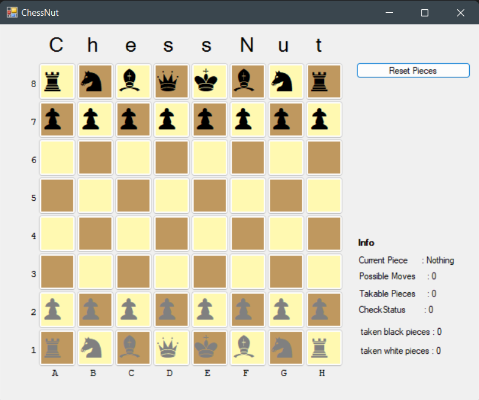

# ChessNut
Chess being written in c#

  

## Development To Do List

#### Game
* [ ] Check/CheckMate/StaleMate
* [ ] Castling
* [ ] Pawn Promotion (In Development)
* [ ] En Passant

#### Git
* [ ] Fonts Prerequisits
* [ ] Fix gitignore
* [ ] Create a Release 
